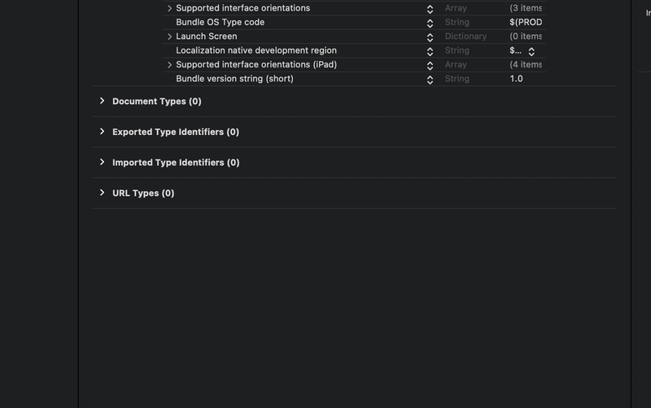

# iOS 설정하기
아임포트 리액트 네이티브 모듈 설정 안내입니다.
iOS에서 아임포트 결제연동 모듈을 사용하기 위해서는 아래 3가지 항목을 설정해주셔야 합니다.

#### 1. App Scheme 등록
외부 결제 앱(e.g. 페이코, 신한 페이판)에서 결제 후 돌아올 때 사용할 URL identifier를 설정해야 합니다.

```html
<key>CFBundleURLTypes</key>
<array>
  <dict>
    <key>CFBundleURLSchemes</key>
    <array>
      <string>myawesomeapp</string>
    </array>
  </dict>
</array>
```

1. `[프로젝트 폴더]/ios/[프로젝트 이름]/Info.plist` 파일을 연 후 `URL Types`속성을 추가합니다.
2. `URL Schemes`에 원하는 scheme 값을 입력합니다.

#### 2. 외부 앱 리스트 등록
3rd party앱(예) 간편결제 앱)을 실행할 수 있도록 외부 앱 리스트를 등록해야합니다.

1. `[프로젝트 폴더]/ios/[프로젝트 이름]/Info.plist` 파일을 오픈합니다.
2. [LSApplicationQueriesSchemes](https://developer.apple.com/library/content/documentation/General/Reference/InfoPlistKeyReference/Articles/LaunchServicesKeys.html#//apple_ref/doc/uid/TP40009250-SW14) 속성을 추가하고 아래에 외부 앱 리스트를 등록합니다.

```html
<key>LSApplicationQueriesSchemes</key>
<array>
  <string>kftc-bankpay</string> <!-- 계좌이체 -->
  <string>ispmobile</string> <!-- ISP모바일 -->
  <string>itms-apps</string> <!-- 앱스토어 -->
  <string>hdcardappcardansimclick</string> <!-- 현대카드-앱카드 -->
  <string>smhyundaiansimclick</string> <!-- 현대카드-공인인증서 -->
  <string>shinhan-sr-ansimclick</string> <!-- 신한카드-앱카드 -->
  <string>smshinhanansimclick</string> <!-- 신한카드-공인인증서 -->
  <string>kb-acp</string> <!-- 국민카드-앱카드 -->
  <string>mpocket.online.ansimclick</string> <!-- 삼성카드-앱카드 -->
  <string>ansimclickscard</string> <!-- 삼성카드-온라인결제 -->
  <string>ansimclickipcollect</string> <!-- 삼성카드-온라인결제 -->
  <string>vguardstart</string> <!-- 삼성카드-백신 -->
  <string>samsungpay</string> <!-- 삼성카드-삼성페이 -->
  <string>scardcertiapp</string> <!-- 삼성카드-공인인증서 -->
  <string>lottesmartpay</string> <!-- 롯데카드-모바일결제 -->
  <string>lotteappcard</string> <!-- 롯데카드-앱카드 -->
  <string>cloudpay</string> <!-- 하나카드-앱카드 -->
  <string>nhappcardansimclick</string> <!-- 농협카드-앱카드 -->
  <string>nonghyupcardansimclick</string> <!-- 농협카드-공인인증서 -->
  <string>citispay</string> <!-- 씨티카드-앱카드 -->
  <string>citicardappkr</string> <!-- 씨티카드-공인인증서 -->
  <string>citimobileapp</string> <!-- 씨티카드-간편결제 -->
  <string>kakaotalk</string> <!-- 카카오톡 -->
  <string>payco</string> <!-- 페이코 -->
  <string>lpayapp</string> <!-- (구)롯데 L페이 -->
  <string>hanamopmoasign</string> <!-- 하나카드 공인인증앱 -->
  <string>wooripay</string> <!-- (구) 우리페이 -->
  <string>nhallonepayansimclick</string> <!-- NH 올원페이 -->
  <string>hanawalletmembers</string> <!-- 하나카드(하나멤버스 월렛) -->
  <string>chaipayment</string> <!-- 차이 -->
  <string>kb-auth</string> <!-- 국민 -->
  <string>kbbank</string> <!-- 국민 스타뱅킹 -->
  <string>hyundaicardappcardid</string>  <!-- 현대카드 -->
  <string>com.wooricard.wcard</string>  <!-- 우리won페이 -->
  <string>lmslpay</string>  <!-- 롯데 L페이 -->
  <string>lguthepay-xpay</string>  <!-- 페이나우 -->
  <string>liivbank</string>  <!-- Liiv 국민 -->
  <string>supertoss</string> <!-- 토스 -->
  <string>newsmartpib</string> <!-- 우리WON뱅킹 -->
  <string>ukbanksmartbanknonloginpay</string> <!-- 케이뱅크 페이 -->
</array>
```

#### 3. App Transport Security 설정


1. `[프로젝트 폴더]/ios/[프로젝트 이름]/Info.plist` 파일을 오픈합니다.
2. `App Transport Security` 속성을 추가합니다.
3. 하부 속성에 `Allow Arbitrary Loads in Web Content`,`Allow Arbitrary Loads` 속성을 추가하고 각각의 값(value)을 `YES`로 변경합니다.

```html
<key>NSAppTransportSecurity</key>
<dict>
  <key>NSAllowsArbitraryLoadsInWebContent</key>
  <true/>
  <key>NSAllowsArbitraryLoads</key>
  <true/>
</dict>
```
